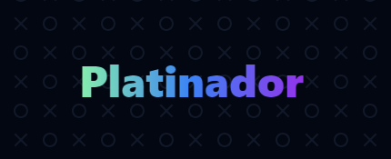

# 🏆 Platinador

O platinador facilitará sua busca pelas suas platinas unificando aqueles jogos que não são mais possíveis de se platinar ou que estão com restrições temporárias em um lugar só!

## Guia de estados

O Platinador classifica os jogos em dois estados, sendo eles:

| Estado | Exemplo |
|--|--|
|Implatinável ❌|O jogo não tem mais uma platina obtível. Um exemplo desse caso é quando o jogo tem seus servidores fechados permanentemente.|
|Em restrição ⚠|O jogo por algum motivo não está com sua platina obtível. Um exemplo desse caso é um bug conhecido que tem previsão de correção ou queda temporária de servidor.|

## Contribuindo
Contribuições são bem-vindas. Abra uma **Issue** caso precise reportar algo ou sugerir adições ou alterações.